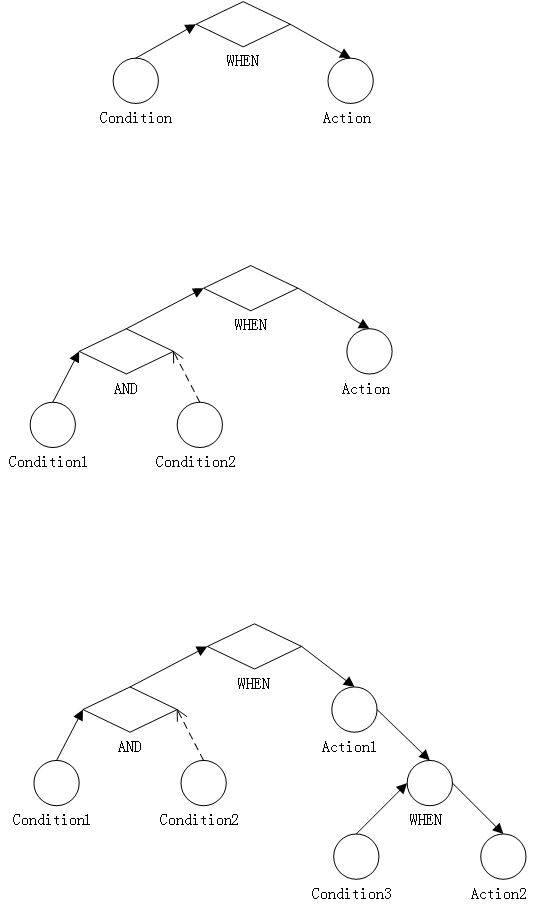

# tree-rules
+ 添加 tree-rules 依赖：

    ```xml
    <dependency>
        <groupId>org.jzp.code</groupId>
        <artifactId>tree-rules</artifactId>
        <version>${version}</version>
    </dependency>
    ```
    
+ 规则引擎结构图：

    

+ 规则表达式Demo：[Demo](src/test/resources/test.json)

+ API文档[这里](API.md)。

+ SPRING接入文档[这里](SPRING.md)。

+ 历史版本:

	+ 1.0.0:
		
		+ 基本功能实现。